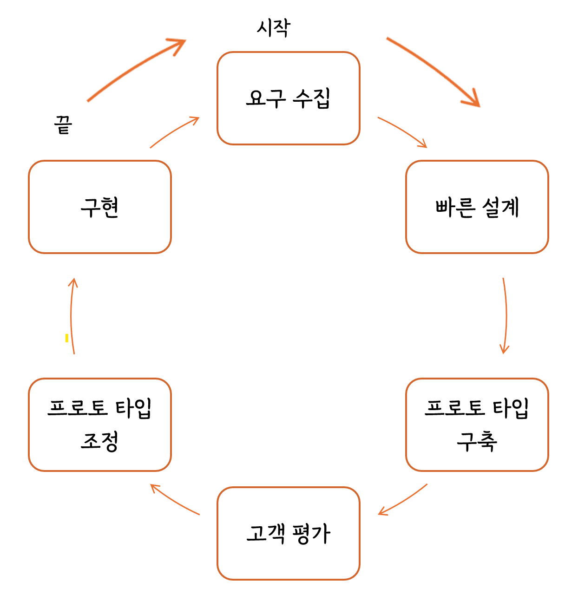
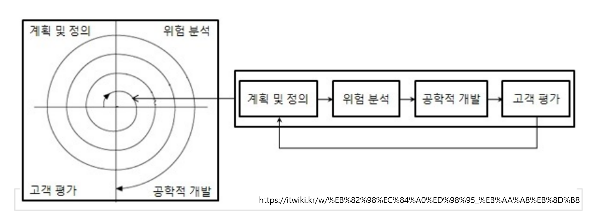
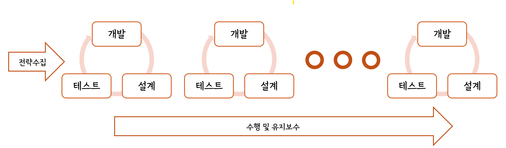

# 소프트웨어 생명 주기

## 1. 소프트웨어 생명주기(Software Life Cycle)

- 소프트웨어 생명 주기는 소프트웨어 개발 방법론의 바탕이 되는 것
- 소프트웨어를 개발하기 위해 정의하고 운용, 유지보수 등의 과정을 각 단계별로 나눈 것
- 요구사항을 분석, 설계에 맞게 개발 후 소프트웨어의 품질이 향상 최상의 상태ㅇ를 유지할 수 있도록 과정을 나눈 것 :arrow_right: 소프트웨어 생명주기
- 소프트웨어 개발 단계와 주요 활동, 그리고 활동의 결과에 대한 산출물로 표현(소프트웨어 수명 주기라고도 함)
- 폭포수 모형, 프로토타입 모형, 나선형 모형, 애자일 모형 등이 있음

### 소프트웨어 공학

- `소프트웨어 공학`은 소프트웨어의 위기를 극복하기 위한 방안으로 연구된 학문
- 여러가지 방법론과 도구, 관리 기법들을 통하여 소프트웨어의 품질과 생산성을 향상
- IEEE의 소프트웨어 공학 표준 용어 사전 : 소프트웨어의 개발, 운용, 유지보수, 폐기처분에 대한 체계적인 접근 방안
- Fairley : 지정된 비용과 기간 내에 소프트웨어를 체계적으로 생산하고 유지보수하는 데 관련된 기술적이고 관리적인 원리
- Boehm : 과학적인 지식을 소프트웨어 설계와 제작에 응요하는 것이며 이를 개발, 운용, 유지보수하는 데 필요한 문서 작성 과정
- 소프트웨어 공학의 기본 원칙
  - 현대적인 프로그래밍 기술을 계속적으로 적용
  - 개발된 소프트웨어의 품질이 유지되도록 지속적으로 검증
  - 소프트웨어 개발 관련 사항 및 결과에 대한 명확한 기록을 유지

## 2. 폭포수 모형(Waterfall Model)

`폭포수 모형`은 이전 단계로 돌아갈 수 없다는 전제하에 각 단계를 확실히 매듭짓고 그 결과를 철저하게 검토하여 승인 과정을 거친 후에 다음 단계를 진행하는 개발 방법

- 가장 오래되고 가장 폭넓게 사용된 전통적인 소프트웨어 생명 주기 모형, 고전적 생명 주기 모형이라고도 함
- 소프트웨어 개발 과정의 한 단계가 끝나야만 다음 단계로 넘어갈 수 있는 <mark>선형 순차적 모형</mark>
- 모형을 적용한 경험과 성공 사례가 많음
- 일부가 될 메뉴얼을 작성해야함
- 각 단계가 끝난 후 다음 단계를 위한 결과물이 명확하게 산출
- 두 개 이상의 과정이 병행하여 수행 x

## 3. 프로토타입 모형(Prototype Model, 원형 모형)

`프로토타입 모형`은 사용자의 요구사항을 정확히 파악하기 위해 실제 개발될 소프트웨어에 대한 견본(시제)품을 만들어 최종 결과물을 예측하는 모델

- 시제품은 의뢰자나 개발자 모두에게 공동의 참조 모델 :arrow_right: 인터페이스 중심 개발이라고도 함
- 일부 혹은 시스템의 모형을 만드는 과정으로서 요구된 소프트웨어를 구현 :arrow_right: 추후 단계에서 상용될 골격 코드
- 새로운 요구사항이 도출될 떄마다 이를 반영한 프로토타입을 새롭게 만들면서 소프트웨어 구현
- 단기간 제작을 목적으로 하다 보니 비효율적인 언어나 알고리즘이 사용될 수 도 있음

## 4. 나선형 모형(Spiral Model, 점진적 모델

`나선형 모델`은 보혐(Boehm)이 제안한 것, 폭포수 모형과 프로토 타입 모형의 장점에 위험 분석 기능을 추가한 모형

- 나선을 돌듯이 여러 번의 소프트웨어 개발 과정을 거쳐 점진적으로 완벽한 최종 소프트웨어를 개발하는 것
- 개발을 하면서 발생할 수 있는 위험을 관리하고 최소화하는 것을 목적
- 핵심 기술에 문제가 있거나 사용자의 요구사항이 이해하기 어려운 경우에 적합
- 점진적으로 개발 과정이 반복되므로 <mark>누락되거나 추가된 요구사항을 첨가할 수 있고 유지보수가 필요 없음</mark>

## 5. 애자일 모형(Agile Model)

`애자일` 은 '민첩한', '기민한'이라는 의미, 고객의 요구사항, 변화에 유연하게 대응할 수 있도록 일정한 주기를 반복하면서 개발과정 진행

- 어느 특정 개발 방법론이 아니라 좋은 것을 빠르고 낭비 없게 만들기 위해 고객과의 소통에 초점을 맞춘 방법론을 통칭
- 기업 활동 전반에 걸쳐 사용
- 스프린트(Sprint) 또는 이터레이션(Iteration)이라고 불리는 짧은 개발 주기를 반복, 반복되는 주기마다 만들어지는 결과물에 대한 고객의 평가와 요구를 적극 수용
- 스크럼(Scrum), XP(eXtreme Programming), 칸반(Kanban),  Lean,  크리스탈(Crystal), ASD(Adaptive Software Development), 기능 중심 개발(FDD : Feature Driven Development), DSDM(Dynamic Sysgtem Development Method), DAD(Disciplined Agile Delivery) 등

### 애자일 선언

- 애자일 개발 4가지 핵심 가치
  1. 프로세스와 도구보다는 개인과 상호작용에 더 가치를 둔다.
  2. 방대한 문서보다는 실행되는 SW에 더 가치를 둔다.
  3. 계약 협상보다는 고객과 협업에 더 가치를 둔다.
  4. 계획을 따르기 보다는 변화에 반응하는 것에 더 가치를 둔다.
- 애자일 개발 12가지 실행 지침
  1. 유용한 소프트웨어를 빠르고, 지속적으로 제공하여 고객을 만족
  2. 개발 막바지라도 요구사항 변경을 적극 수용
  3. 몇 개월이 아닌 몇 주 단위로 실행되는 소프트웨어를 제공
  4. 고객과 개발자가 프로젝트 기간에 함께 일한다.
  5. 개발에 대한 참여 의지가 확실한 사람들로 팀을 구성, 필요한 개발 환경과 지원을 제공하여, 일을 잘 끝낼 수 있도록 신뢰
  6. 같은 사무실에서 얼굴을 맞대고 의견을 나눈다
  7. 개발의 진척도를 확인하는 1차 기준은 작동하는 소프트웨어이다.
  8. 지속 가능한 개발을 장려하고 일정한 속도로 개발을 진행한다.
  9. 기술적 우수성과 좋은 설계에 지속적인 관심을 기울이면 민첩성이 향상된다.
  10. 단수화를 추구
  11. 최상의 아키텍처, 명확한 요구사항, 최상의 설계는 자기 스스로 일을 주도하는 조직적인 팀으로부터 나온다.
  12. 더 효과적인 팀이 될 수 있는 방안을 정기적으로 깊이 고민, 그에 따라 팀의 행동을 조정

## 6. 폭포수 모형 vs 애자일 모형의 비교

| 구분                 | 폭포수 모형                 | 애자일                                  |
| -------------------- | --------------------------- | --------------------------------------- |
| 새로운 요구사항 반영 | 어려움                      | 지속적으로 반영                         |
| 고객과의 의사소통    | 적음                        | 지속적임                                |
| 테스트               | 마지막에 모든 기능을 테스트 | 반복되는 일정 주기가 끝날 때마다 테스트 |
| 개발 중심            | 계획, 문서(매뉴얼)          | 고객                                    |

