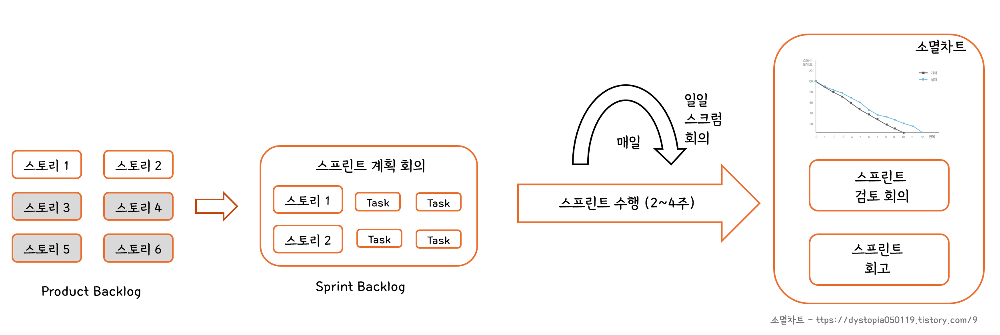

# 스크럼(Scrum) 기법

## 1. 스크럼의 개요

- 스크럼은 팀의 중심이 되어 개발의 효율성을 높인다는 의미가 내포된 용어
- 팀원 스스로가 스크럼 팀을 구성(self-organizing)해야 하며, 개발 작업에 관한 모든 것을 스스로 해결(self-functional)
- 스크럼 팀은 제품 책임자, 스크럼 마스터, 개발팀으로 구성

### 제품 책임자(PO; Pruduct Owner)

- 이해관계자들 중 개발될 제품에 대한 이해도가 높고, 요구사항을 책임지고 의사 결정할 사람으로 선정하는데, 주로 개발 의뢰자나 사용자가 담당
- 이해관계자들의 의견을 종합 제품에 대한 요구사항을 작성하는 주체
- 요구사항이 담긴 백로그를 작성하고 백로그에 대한 우선순위를 지정
  - 백로그 :arrow_right: 제품 개발에 필요한 요구사항을 모두 모아 우선순위를 부여해 높은 목록 
- 팀원들은 백로그에 스토리 추가 :o:, 우선순위 지정 :x:
- 테스트를 수행하면서 주기적으로 요구사항의 우선순위를 갱신

### 스크럼 마스터(SM; Scrum Master)

- 스크럼 팀이 스크럼을 잘 수행할 수 있도록 객관적인 시각에서 조언해주는 가이드 역할, 통제:x:
- 일일 스크럼 회의를 주관하여 진행 사항을 점검, 개발 과정에서 발생된 장애 요소를 공론화 처리

### 개발팀(DT ; Development Team)

- 제품 책임자와 스크럼 마스터를 제외한 모든 팀원, 개발자 외에도 디자이너, 테스트 등 제품 개발을 위해 참여하는 모든 사람이 대상
- 보통 최대 인원은 7~8명

## 2. 스크럼 개발 프로세스

### 제품 백로그(Product Backlog)

- 우선 순위를 정하는 사람 :arrow_right: 제품 책임자
- 제품 개발에 필요한 모든 요구사항을 우선순위에 따라 나열한 목록
- 개발 과정 중 새롭게 도출되는 요구사항을 지속적으로 업데이트
- 제품 백로그에 작성된 사용자 스토리를 기반으로 전체 일정 계획인 릴리즈 계획(Release Plan) 수립

### 스프린트 계획(Sprint Planning Meeting)

- 스크럼 마스터가 주관
- 백로그 중 이번 스프린트에서 주생할 작업 대상으로 단기 일정 수립
- 요구사항을 개발자들이 나눠서 작업할 수 있도록 태스크(Task)라는 작업 단위로 분할 후 개발자별로 수행할 작업 목록인 스프린트 백로그 작성

### 스프린트(Sprint)

- 실제 개발 작업을 진행하는 과정, 보통 2~4주
- 백로그에 작성된 태스크를 대상으로 속도를 추정한 후 개발 담당자에게 할당 , 개발자가 원하는 태스크를 직접 선별하여 담당하는 것이 좋음

### 일일 스크럼 회의(Daily Scrum Meeting)

- 모든 팀원이 매일 약속된 시간에 짧은 시간동안 미팅
- 남은 작업 시간은 소멸 차트(Burn-down Chart)에 표시
- 발견된 장애 요소를 해결할 수 있도록 스크럼 마스터가 도와줌

### 스프린트 검토 회의(Sprint Review)

- 제품 책임자가 주관, 매주 진행
- 제품 책임자는 개선할 사항에 대한 피드백을 정리 후 다음 스프린트에 반영할 수 있도록 제품 백로그 업데이트

### 스프린트 회고(Sprint Retrospective)

- 팀원들끼리 수행
- 해당 스프린트가 끝난 시점에서 수행하거나 일정 주기로 수행

